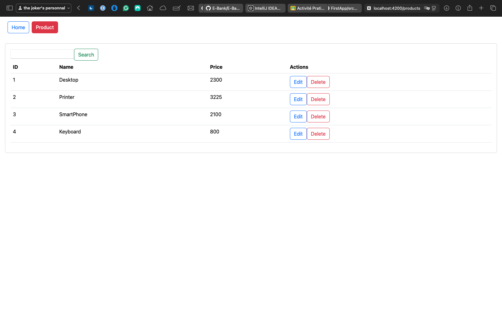
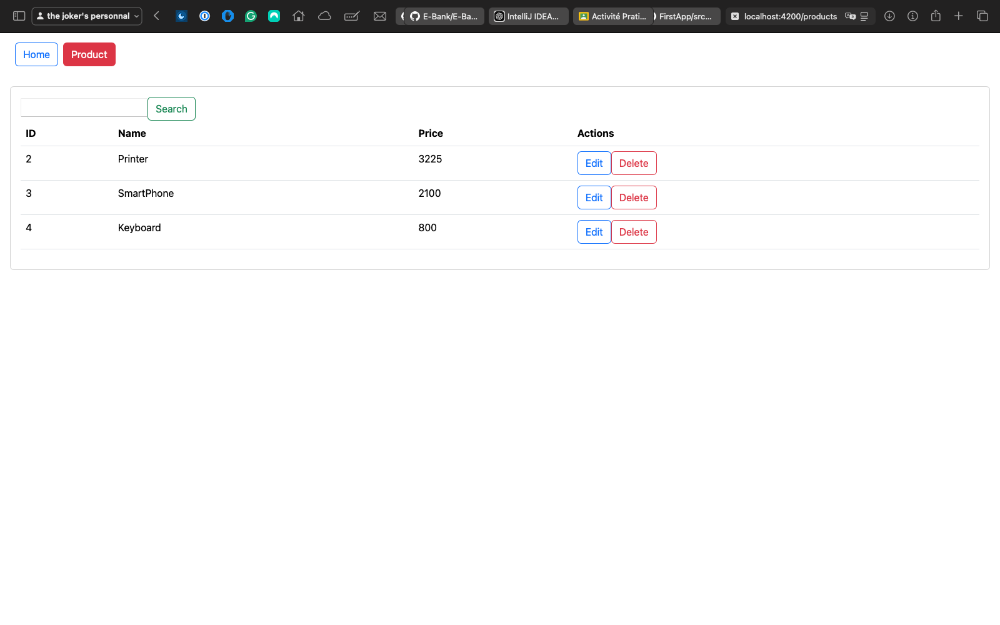
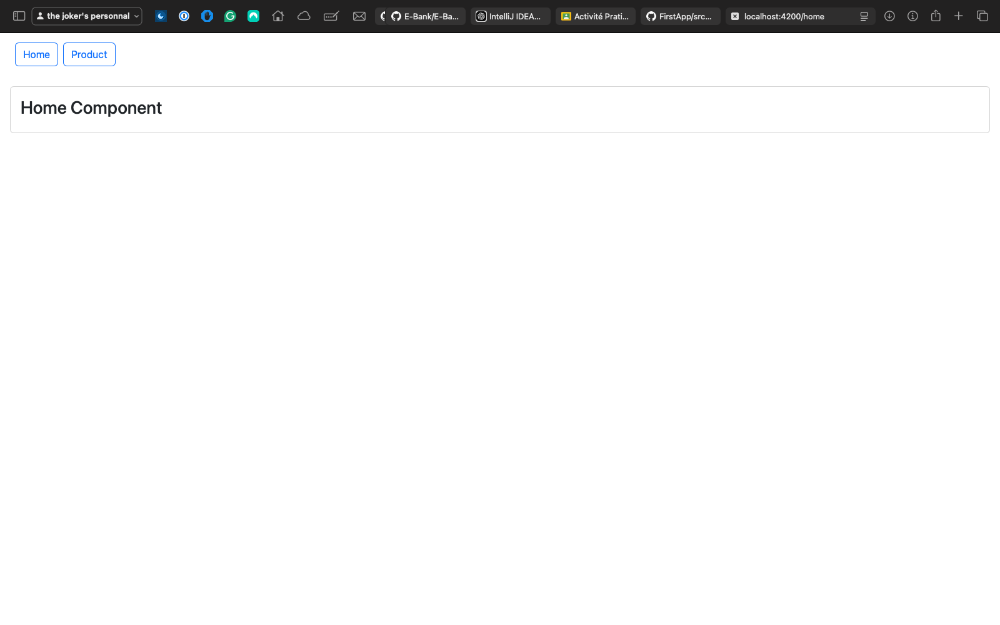
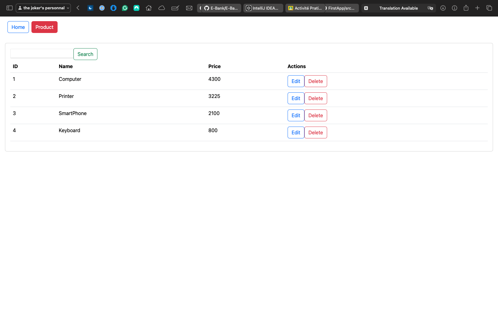
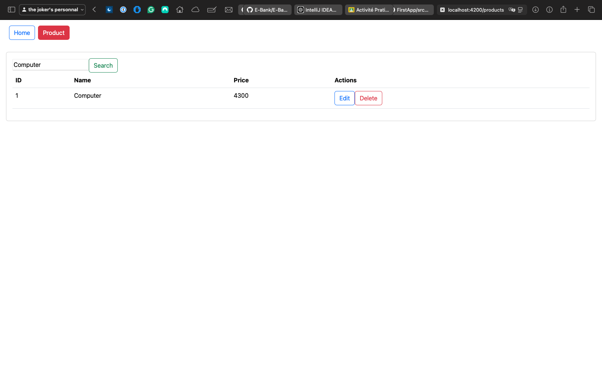

# FirstApp

This project was generated using Angular CLI version **19.0.5**.

## Author
**Mohamed Lakssir**  
Class: **2ACI Info**

## Table of Contents
- [Development Server](#development-server)
- [Code Scaffolding](#code-scaffolding)
- [Building](#building)
- [Running Unit Tests](#running-unit-tests)
- [Running End-to-End Tests](#running-end-to-end-tests)
- [Linting](#linting)
- [Version Compatibility](#version-compatibility)
- [Project Structure](#project-structure)
- [Additional Resources](#additional-resources)

---

## Development Server

To start a local development server, run the following command:

```bash
ng serve
```

Once the server is running, open your browser and navigate to [http://localhost:4200/](http://localhost:4200/). The application will automatically reload whenever you modify any of the source files.

### Customizing the Development Server
- To change the default port:
  ```bash
  ng serve --port <your-port>
  ```
- To enable hot module replacement (HMR):
  ```bash
  ng serve --hmr
  ```

---

## Code Scaffolding

Angular CLI provides powerful scaffolding tools to streamline development. To generate a new component, run:

```bash
ng generate component <component-name>
```

### Common Scaffolding Commands
- **Component**: `ng generate component <component-name>`
- **Directive**: `ng generate directive <directive-name>`
- **Pipe**: `ng generate pipe <pipe-name>`
- **Service**: `ng generate service <service-name>`
- **Module**: `ng generate module <module-name>`

For a complete list of schematics, use:

```bash
ng generate --help
```

---

## Building

To build the project for deployment, use:

```bash
ng build
```

The compiled files will be stored in the `dist/` directory. By default, this creates a production-optimized build. To build for a specific environment or configuration, use:

```bash
ng build --configuration=<config-name>
```

### Build Options
- Enable source maps for debugging:
  ```bash
  ng build --source-map
  ```
- Analyze the bundle size:
  ```bash
  ng build --stats-json
  ```

---

## Running Unit Tests

To execute unit tests using the [Karma Test Runner](https://karma-runner.github.io), run:

```bash
ng test
```

### Tips
- To watch for file changes during testing:
  ```bash
  ng test --watch
  ```
- To run specific tests, use the `fit` or `fdescribe` methods in your test files.

---

## Running End-to-End Tests

For end-to-end testing, use the following command:

```bash
ng e2e
```

Angular CLI does not come with an end-to-end testing framework by default. To set up e2e testing, you can install and configure a framework like [Cypress](https://www.cypress.io/) or [Protractor](https://www.protractortest.org/).

---

## Linting

To ensure code quality and consistency, run the linter with:

```bash
ng lint
```

### Tips
- Automatically fix lint errors:
  ```bash
  ng lint --fix
  ```

---

## Version Compatibility

### Node.js
Ensure you are using a compatible Node.js version. Angular CLI **19.0.5** is optimized for Node.js LTS versions. Check your current Node.js version:

```bash
node -v
```

To update Node.js to the latest LTS version, use [nvm](https://github.com/nvm-sh/nvm):

```bash
nvm install --lts
nvm use --lts
```

---

## Project Structure

Below is the project structure:

```
.
├── README.md
├── ScreenShot
│   ├── ChangeComputerToDesktopandPrice.png
│   ├── DeleteDesktop.png
│   ├── Homecomponent.png
│   ├── ProductComponent.png
│   └── SearchCustomer.png
├── angular.json
├── package-lock.json
├── package.json
├── project_structure.txt
├── public
│   └── favicon.ico
├── src
│   ├── app
│   │   ├── app-routing.module.ts
│   │   ├── app.component.css
│   │   ├── app.component.html
│   │   ├── app.component.spec.ts
│   │   ├── app.component.ts
│   │   ├── app.module.ts
│   │   ├── home
│   │   │   ├── home.component.css
│   │   │   ├── home.component.html
│   │   │   ├── home.component.spec.ts
│   │   │   └── home.component.ts
│   │   └── products
│   │       ├── products.component.css
│   │       ├── products.component.html
│   │       ├── products.component.spec.ts
│   │       └── products.component.ts
│   ├── index.html
│   ├── main.ts
│   └── styles.css
├── tsconfig.app.json
├── tsconfig.json
└── tsconfig.spec.json

7 directories, 31 files
```

---

## Screenshots
Here are some screenshots of the application:

- **Change Computer to Desktop and Price:**
  

- **Delete Desktop:**
  

- **Home Component:**
  

- **Product Component:**
  

- **Search Customer:**
  

---

### Notes
If you encounter any issues, feel free to open an issue or consult the Angular documentation for troubleshooting guidance.
